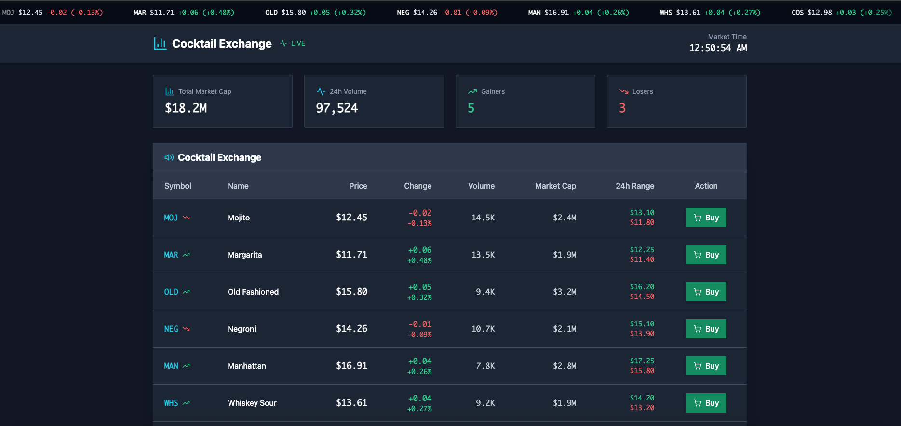
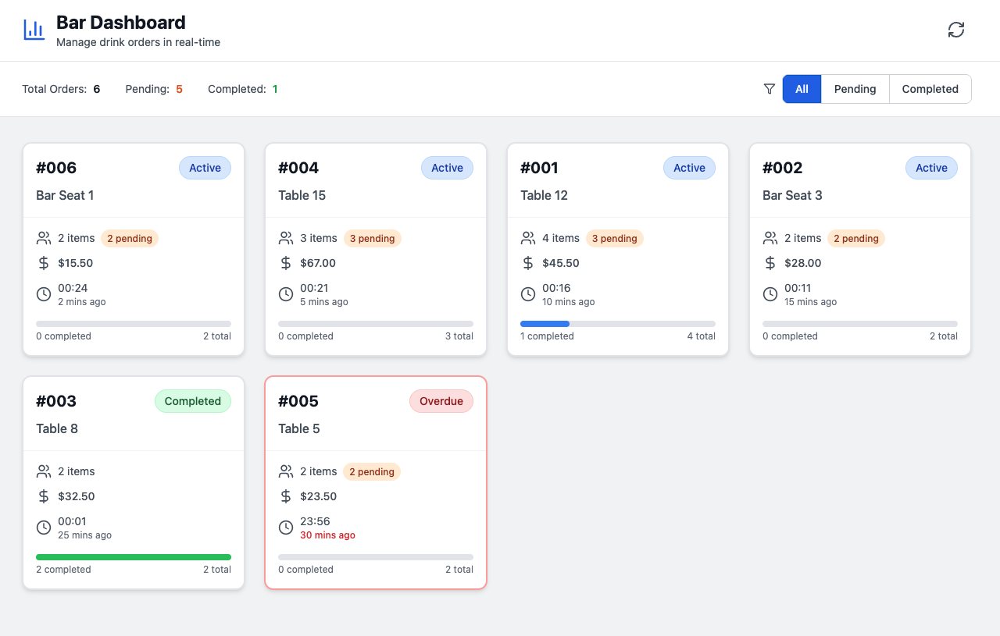

# 🍸 Cocktail Trader

**Cocktail Trader** is a web application for managing and trading cocktail orders in a bar environment. This project uses a Python backend (Flask) and includes Kafka-based components for real-time event processing.

---

## 🔧 Getting Started

### 1. Initialize Backend

First, activate the virtual environment:

```bash
cd cocktail-trader/backend
source .venv/bin/activate
```

### 1.1 Run Docker Compose

```bash
cd cocktail-trader
docker-compose up -d
```

This will execute a docker instance for Postgres, Redis and Kafka so you can use it during execution time.


### 2. Load Dummy data
Run the following script to initialize the database and create dummy data:

```bash
cd cocktail-trader/backend
python -m scripts.init_db
```

This will create the necessary tables and populate them with example data.

### 3. Run the application

Start the Flask app with:

```bash
cd cocktail-trader/backend
python -m app.run
```
This will launch the backend server.

### 4. Run Kafka Consumer

To start the Kafka consumer that listens for events:

```bash
cd cocktail-trader/backend
python -m scripts.kafka_consumer
```

## 🧪 Requirements

```bash
cd cocktail-trader/
pip install -r requirements.txt # TODO
```

## 📁 Project Structure

```bash
cocktail-trader/
│
├── backend/
│   ├── app/              # Flask application
│   ├── scripts/          # Helper and init scripts
│   ├── .venv/            # Virtual environment
│   └── ...
├── frontend/			  # Visualize Drink prices
├── admin_frontend/       # Dashboard for order management
```

## ⚡ Frontend

The frontend of this project was generated using [bolt.new](https://bolt.new), an AI tool for building modern React interfaces.  
The generated components were customized to fit the bar order management use case.

### 5. Run frontend and admin_dashboard

Run price change screen

```bash
cd cocktail-trader/frontend
npm install
npm run dev
```

Run admin dashboard

```bash
cd cocktail-trader/admin_frontend
npm install
npm run dev
```

## Screenshots

### Drinks Price Change Screen



### Admin Frontend




## 📫 Contact

For questions or feedback, feel free to reach out or open an issue in this repository.